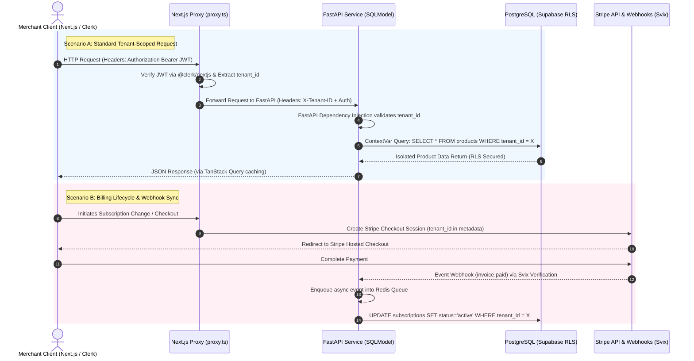

# AGENTS.md — Repository Guidance & Architectural Constraints

This document defines the absolute architectural boundaries, explicit developer loops, syntax contracts, and structural invariants for AI agents working in this repository. OpenCode must strictly follow these instructions to prevent hallucinations, broken typings, or cross-tenant data leaks.

---

## 🧭 Quick Reference (Zero-Deviation Rules)

* **Stack:** Next.js 16.2 (React 19) + Python 3.14 + FastAPI + Turborepo + PostgreSQL (Supabase RLS) + Clerk Auth v7 + uv + Doppler
* **Data Isolation:** Enforced via `tenant_id: uuid.UUID` on all SQLModel definitions and PostgreSQL Row-Level Security (RLS).
* **The DB Query Ban:** Never write raw database queries or instantiate raw database connections inside frontend applications (`apps/`) or raw API route folders. Use `packages/tenant-orm` (TypeScript) and `services/backend-api/src/orm` (Python).
* **Source of Truth:** The Python backend engine is the absolute source of truth for all schemas and data constraints.
* **Python Tooling:** All Python commands **must** be prefixed with `uv run`. Never use `pip`, `pipenv`, or direct local binary invocation.
* **SecretOps:** Manage all secrets via Doppler (`doppler run`). Never write, read, or commit `.env` files. Fallbacks on environment variables are strictly forbidden.

---

## 1. Monorepo Topology & Project Structure

Maintain pristine workspace encapsulation. Never cross-contaminate package boundaries or write decoupled modules outside their designated scope.

```text
├── apps/
│   ├── admin/               # Next.js admin control panel (Tenant & Platform management)
│   │   └── src/app/         # Modern App Router structure utilizing clean layouts
│   └── storefront/          # Next.js dynamic e-commerce storefront engine
│       └── src/app/         # Dynamic storefront engine utilizing clean layouts
├── packages/
│   ├── auth/                # Clerk auth utilities, JWT verification token utilities
│   ├── codegen/             # Automatically generated API clients and Zod schemas (Do not modify manually)
│   ├── db/                  # Raw migration scripts, Alembic targets, and schema setups
│   ├── eslint-config/       # Monorepo tooling standards
│   ├── proxy.ts             # Global Next.js runtime edge execution proxy (Replaces middleware.ts)
│   ├── shared-utils/        # cn() helper, date formatting, layout utilities
│   ├── tenant-orm/          # TS multi-tenant data access wrappers, Supabase clients, schema separation
│   ├── typescript-config/   # Monorepo TypeScript config contracts
│   └── ui/                  # Design tokens, CSS-first Tailwind 4.x engine, shadcn/ui + Base UI primitives
├── services/
│   └── backend-api/         # FastAPI core engine (Python 3.14)
│       └── src/
│           ├── orm/         # SQLModel definitions, database engines, and migration metadata
│           └── routes/      # Endpoints, webhooks, and core logic mapping
└── AGENTS.md                # This file (Agent Operational Boundary System)

```

### Logical Package Boundaries

* **`packages/tenant-orm/src/schemas/` Separation:** * `global/` schemas handle platform-level administration metadata.
* `tenant/` schemas govern isolated e-commerce states (Products, Orders, Settings) and explicitly mandate tenant scoping.

* **No Local State Leakage:** Never generate, read, or commit local database binaries, SQLite containers, raw SQL dumps (`.sql`), or runtime-generated migration cache files outside of designated `packages/db` structures.

---

## 2. Polyglot Core Flow & Data Synchronization



### The Generation Loop (Backend-to-Frontend)

1. **Source of Truth:** Modify or create schemas exclusively within `services/backend-api/src/orm/models` using SQLModel.
2. **Automated Compilation Pipeline:** All client-side data structures, typing frameworks, and validation objects are extracted down from the FastAPI auto-generated OpenAPI JSON contract via `@hey-api/openapi-ts` with `@hey-api/plugin-zod` enabled.
3. The artifacts compile directly into `packages/codegen/src/generated`. **Never manually declare, copy-paste, or modify standalone Zod schemas or TypeScript types on the frontend** that mimic backend structures.

---

## 3. Frontend Syntactical Contracts & Constraints

### React 19, Form Actions, & Events

* **Form Submissions:** Interactive event handlers managing form submissions must use native React 19 typed form actions (`<form action={action}>`) or structural `SubmitEvent` types. **Do not use legacy React.FormEvent preventDefault boilerplate.** * **Action States:** Prefer Server Actions for form mutations, utilizing the `useActionState` hook for pending state animations and native server-side validation feedback.

### Client-Side Validation Bindings

* When mapping user inputs to form validation primitives (e.g., React Hook Form), use the auto-generated schemas exported from `@repo/codegen` via `zodResolver(ProductCreateSchema)`.
* Use `.pipe()` or sub-object intersections purely to decorate frontend-specific transient UI configurations.

### Clerk Authentication (v7.4.2+)

* **Component Structures:** Conditional rendering wrappers like `<SignedIn>` or `<SignedOut>` are deprecated. For visual client-side layout gates, use the updated unified structural layout flags: `<Show when="signed-in">...</Show>` or `<Show when="signed-out">...</Show>`.
* **Security Isolation Policy:** Client-side wrappers are for visual UI feedback only. Security gating, data access protection, and route access validation must be evaluated entirely server-side inside `packages/proxy.ts` or via backend authentication headers.

### Styling & State Management

* **Tailwind CSS 4.x Engine:** Do not create or edit JavaScript-based `tailwind.config.js` setups. All design systems, tokens, variables, and themes must be declared via CSS-first `@theme` syntax rules inside the `packages/ui` workspace. Maximize the use of `@base-ui/react` primitives.
* **Class Merging:** Always wrap conditional CSS or tailwind modifications inside the centralized `cn()` utility exported from `@repo/shared-utils` or `@repo/ui`.
* **State Engines:** Fetching and cache mutation state must utilize **TanStack React Query**. UI state must utilize **Zustand**. Avoid introducing Redux. Default to React Server Components (RSC); use `'use client'` strictly for event listeners, interactivity, or browser APIs.

---

## 4. Backend & Storage Tier Isolation Strategy

### Python Multi-Tenant Paranoia

* **Contextual Tracking:** The Python ORM tier (`services/backend-api/src/orm`) must capture and inject the current scope via a thread-safe Python `contextvars` variable (`current_tenant_id`) populated automatically through FastAPI dependencies or middleware extraction pipelines.
* **No Leakage:** Do not pass the `tenant_id` as an explicit parameter in application-level standard CRUD function signatures.

### Database Migration Fail-Safe

* Multi-tenancy is structurally protected via PostgreSQL (Supabase) **Row-Level Security (RLS)**.
* Every database migration script managed via **Alembic** inside `packages/db` must explicitly execute an RLS isolation lock when registering tables:

```sql
ALTER TABLE ... ENABLE ROW LEVEL SECURITY;
```

Do not deploy tables relying purely on application layer validation rules.

* **Applying Migrations:** To apply migrations locally, execute: `uv run alembic upgrade head` inside the correct workspace boundary. Never apply direct raw SQL modifications or bypass Alembic manually.

---

## 5. Python Package & Tooling Enforcement (`uv`)

* **Execution Guardrail:** Prepend ALL Python scripts, tools, test hooks, or formatting commands with `uv run`.
* **Dependency Modification:** Add or adjust backend Python packages exclusively using `uv add <package_name>`. Never use `pip`, `poetry`, or run internal `.venv` shell sourcing sequences (`source .venv/bin/activate`).
* **Lockfile Sanity:** The `uv.lock` file is part of our delivery core contract and must be safely tracked in git. After updating configurations or adding dependencies within `services/backend-api`, run `uv lock` to synchronize before triggering testing stages.
* **FastAPI Execution:** Run the local server using `uv run fastapi dev`.

---

## 6. Verification Pipeline Order

When models, schemas, or data endpoints change, follow this sequential execution path. If any step fails, stop the execution immediately:

```text
Step 1: [Backend Diagnostics]  -->  turbo run test --filter=backend-api
Step 2: [Schema Sync]          -->  Compile FastAPI openapi.json down through @hey-api/openapi-ts into packages/codegen
Step 3: [Environment Sync]     -->  uv sync --locked
Step 4: [Linting Validation]   -->  turbo run lint
Step 5: [Typecheck validation] -->  turbo run typecheck
Step 6: [Global Testing Suite] -->  turbo run test

```

*Note: If workspace boundaries exhibit cached errors or stale states, apply the `--force` parameter or re-execute `uv sync --locked` to drop and rebuild isolation boundaries.*

---

## 7. Agent Behavior Directives & Skill Hooks

* **Zero Yolo-Coding Policy:** Always generate a clear, step-by-step structural plan detailing which package/app files will be created or modified, and await human confirmation before processing multi-file edits. Ensure your AI environment is configured in "Plan" or "Ask" mode.
* **Skill Invocation Boundary:** When processing complex processing operations (e.g., asynchronous automated store provisioning, webhook processing pipelines), freeze generation and inspect corresponding custom agent hooks located inside `/opencode.json`.
