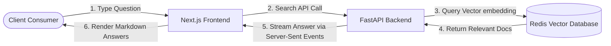

# Planned Future Platform Architecture

## 🚀 Future AI Search Architecture (The Roadmap)

When you choose to implement client-side AI search, your technology stack can adapt seamlessly using this architecture:

## 🛠️ How Your Stack Will Power the AI Search

You will not need to add heavy or complex databases to your current stack. Your existing tools can easily manage the upgrade:

## 1. Redis (As Your Vector Database) [5]

* What it does: The redis package you already have handles vector data out of the box.
* The Implementation: You will convert your Docusaurus markdown files into chunked textual math formulas (called embeddings) and store them inside Redis. When a consumer types an AI search query, Redis performs a lightning-fast vector similarity search in milliseconds. [6, 7]

## 2. FastAPI (As the AI Orchestration Layer) [8]

* What it does: FastAPI handles the heavy lifting of talking to an LLM provider and handling data streams.
* The Implementation: You will write an endpoint that accepts the consumer's query, fetches matching documentation context blocks from Redis, and pushes them into an LLM (like OpenAI's API or a self-hosted model). By using standard Python generator functions, FastAPI can stream the text response back to your frontend in real-time. [9, 10, 11, 12]

## 3. Next.js & TanStack Query (The Consumer Interface)

* What it does: Your frontend consumes the streaming data cleanly without UI lag.
* The Implementation: Using @tanstack/react-query, your client apps can manage the asynchronous fetch requests. You can stream the AI text directly into your Shadcn Base UI and Tailwind CSS v4 component containers, converting raw text back into beautiful code highlights on the fly. [13]

------------------------------

## 💎 Excellent Free & Low-Cost AI Alternatives

If you decide you want AI search inside Docusaurus later without building it entirely from scratch, look into these alternative developer solutions:

* [Algolia DocSearch](https://docsearch.algolia.com/): Completely free for open-source projects. Algolia crawls your Docusaurus documentation automatically. They offer powerful AI-powered natural language search overlays that plug straight into frontend components. [14, 15, 16]
* [Mendable.ai](https://www.mendable.ai/) or [Inkeep](https://inkeep.com/): Dedicated developer documentation search widgets. They offer very generous free tiers specifically for early-stage or open-source projects. They give you a copy-paste chat component to embed directly inside your client interface. [17, 18]

As you begin setting up your primary documentation layer, let me know:

* Would you prefer to embed Docusaurus as a standalone static site (e.g., ://yourdomain.com), or would you prefer a strategy to build it directly inside your Next.js App Router?
* Do you want to see a small preview of how a Drizzle Schema table looks when structured to store text chunks for future AI indexing?

I can help guide your immediate codebase layout to make future AI scaling completely painless.

[1] [https://hackmamba.io](https://hackmamba.io/technical-documentation/top-5-open-source-documentation-development-platforms-of-2024/)
[2] [https://www.gitbook.com](https://www.gitbook.com/blog/best-software-documentation-tools)
[3] [https://levelup.gitconnected.com](https://levelup.gitconnected.com/the-headache-of-maintaining-documentations-in-production-3552d853a923)
[4] [https://developers.redhat.com](https://developers.redhat.com/articles/2025/08/20/how-i-built-agentic-application-docling-mcp)
[5] [https://www.youtube.com](https://www.youtube.com/watch?v=ge4bddJIh0g)
[6] [https://eclipsesource.com](https://eclipsesource.com/blogs/2024/07/26/ai-context-management-in-domain-specific-tools/)
[7] [https://www.youtube.com](https://www.youtube.com/watch?v=YwoaqLsrHew)
[8] [https://levelup.gitconnected.com](https://levelup.gitconnected.com/fastapi-isnt-flashy-but-it-might-be-the-future-of-intelligent-systems-8388e7ff9e9f)
[9] [https://medium.com](https://medium.com/online-inference/building-and-ai-agent-from-scratch-in-python-tutorial-3a106902bc37)
[10] [https://medium.com](https://medium.com/@dwrout/the-rise-of-my-ai-monster-f8c44d14be7e)
[11] [https://developers.redhat.com](https://developers.redhat.com/articles/2025/08/20/how-i-built-agentic-application-docling-mcp)
[12] [https://www.instagram.com](https://www.instagram.com/reel/DU4yaBEiEkH/)
[13] [https://www.youtube.com](https://www.youtube.com/watch?v=LMqGbLt0FPE)
[14] [https://www.algolia.com](https://www.algolia.com/blog/product/algolia-docsearch-is-now-free-for-all-docs-sites)
[15] [https://sphinx-docsearch.readthedocs.io](https://sphinx-docsearch.readthedocs.io/what.html)
[16] [https://intuitionlabs.ai](https://intuitionlabs.ai/articles/alphasense-platform-review)
[17] [https://hourlydeveloper.io](https://hourlydeveloper.io/blog/top-15-ai-development-tools-in-2025)
[18] [https://www.thecloudgirl.dev](https://www.thecloudgirl.dev/blog/top11-ai-coding-assistants-in-2024)
