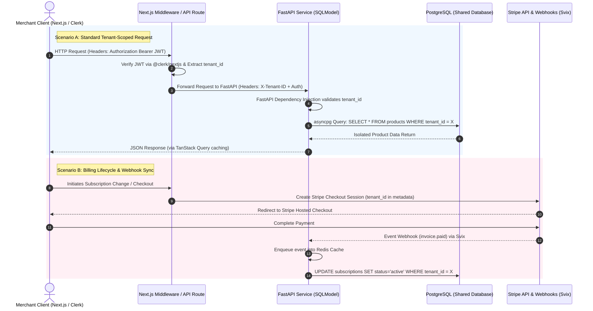

# Project Context & AI Instructions: Next-Turborepo

You are an expert full-stack engineer and systems architect working on **Next-Turborepo**, a production-grade, multi-tenant SaaS boilerplate.

Your goal is to write clean, type-safe, secure, and highly performant code that strictly adheres to the architecture, directory structure, and behavioral conventions defined below.

## 1. Core Architecture & Tech Stack

This is a polyglot monorepo. Next.js handles the Edge, Middleware, and Frontend layers, while Python handles the high-throughput core backend.

### Frontend & Edge (TypeScript)

* **Framework:** Next.js (App Router)
* **UI/Styling:** Tailwind CSS v4, Shadcn UI (Base UI)
* **State & Fetching:** TanStack React Query (atomic caching), React Hook Form + Zod (validation)
* **Auth:** Clerk (`@clerk/nextjs`)

### Backend & Data (Python & SQL)

* **Framework:** FastAPI >=0.115.0 (Uvicorn)
* **ORM/Models:** SQLModel (Pydantic + SQLAlchemy)
* **Database:** PostgreSQL (Async via `asyncpg` and `psycopg3`)
* **Migrations:** Alembic (Python backend), Drizzle Kit (TS frontend)

### Infrastructure & Integrations

* **Billing:** Stripe SDK
* **Webhooks/Queues:** Svix (Webhooks), Redis (Async queues)
* **Secrets Management:** Doppler (Strict SecretOps - no hardcoded secrets)

## 2. Domain Context (E-Commerce / Shopify-like Engine)

You are building the back-office and infrastructure for a comprehensive commerce platform. When generating models, APIs, or UI, keep the following core business domains in mind:

* **Catalog & Inventory:** Products, variants, multi-location stock tracking, automated collections.
* **Order Management (OMS):** Checkout, order routing, fulfillment, returns, and draft orders.
* **Customer & CRM:** Unified profiles, LTV tracking, segmentation, B2B wholesale portals (Net terms, custom price lists).
* **Global Commerce:** Multi-currency, localized domains, cross-border tax/duty calculations.
* **Omnichannel:** POS sync, social/marketplace integrations, Buy Button APIs.

## 3. CRITICAL: Multi-Tenancy & Security Rules

This is a **Shared-Schema Multi-Tenant** architecture. Data isolation is our highest priority.

1. **The `tenant_id` Rule:** EVERY database query, mutation, and data fetch MUST be scoped to a `tenant_id`. Never query global data without explicit authorization.
2. **Row Level Security (RLS):** Ensure database policies enforce tenant isolation at the DB level, not just the application level.
3. **Request Flow for Tenant Context:**
   * Next.js Middleware verifies the Clerk JWT and extracts the `tenant_id`.
   * Next.js Edge/API routes forward the request to FastAPI, passing the `X-Tenant-ID` header.
   * FastAPI uses Dependency Injection to validate the `tenant_id` and inject it into the database session.
4. **SecretOps (Doppler):** NEVER hardcode secrets, API keys, or passwords in source code. NEVER commit `.env` files.

### TypeScript / Next.js

* Prefer React Server Components (RSC) by default. Use Client Components (`"use client"`) only when interactivity or browser APIs are required.
* Use Server Actions for mutations where appropriate, falling back to API routes for complex external integrations.
* Validate all external inputs and form data using **Zod**.
* Use TanStack Query for all client-side data fetching and caching.

### Python / FastAPI

* Always use `async def` for route handlers and database calls.
* Use **SQLModel** for both database models and API request/response schemas to maintain a single source of truth.
* Use FastAPI's `Depends()` for dependency injection (especially for extracting `tenant_id` and DB sessions).
* Rely on FastAPI's automatic OpenAPI schema generation; ensure all endpoints have clear docstrings and response models.

### Database

* Never write raw SQL strings. Use the ORM/Query builders.
* Always use parameterized queries to prevent SQL injection.
* Index `tenant_id` columns on all tenant-scoped tables.

## 4. Repository Structure & File Placement Rules

You MUST place new files in the correct directory according to this tree. Do not create new top-level folders without explicit permission.

```text
├── apps/
│   ├── admin/              # Next.js admin control panel (tenant management)
│   ├── storefront/         # Next.js dynamic e-commerce storefront
├── packages/
│   ├── auth/               # Clerk auth utilities, JWT helpers, middleware factory
│   ├── codegen/            # Auto-generated TypeScript types & Zod schemas from OpenAPI
│   ├── db/                 # Raw migration scripts and schema setup
│   ├── eslint-config/      # Shared ESLint configuration
│   ├── middleware/         # Webhook signature verification, rate limiting, CORS
│   ├── shared-utils/       # cn(), date formatting, common helpers
│   ├── tenant-orm/         # TypeScript multi-tenant data access, Supabase client, Zod schemas
│   ├── typescript-config/  # Shared TS configs (base, nextjs, react-library)
│   ├── ui/                 # Design tokens, Tailwind 4 config, shadcn/ui + Base UI primitives
├── services/
│   ├── backend-api/        # FastAPI/Python backend (SQLModel ORM, routes, webhooks)
├── docs/                   # Documentation, plans, todos

```

-------

## 5. Repository Structure (Turborepo)

**Understand the monorepo layout before creating files:**

**Apps (`apps/`)**

* `frontend`: Marketing site (Tailwind, TWBlocks)
* `admin`: Frontend Admin Dashboard Main SaaS application (Auth, DB, Dashboard) (Tailwind, TWBlocks)
* `api`: RESTful API health checks/monitoring
* `backend-api`: Python FastAPI core engine
* `docs`: Documentation site
* `email`: React Email templates
* `storybook`: Component dev environment

**Packages (`packages/`)**

* Shared logic: `auth`, `db`, `ui` (Design system), `payments`, `email`, `analytics`, `observability`, `security`, `cms`, `seo`, `ai`, `webhooks`, `feature-flags`, `cron`, `storage`, `i18n`, `notifications`.

## 6. System Flow Reference

Use this sequence diagram to understand how the Edge and Backend interact for standard requests and billing:



## 7. AI Behavior Directives

When generating code, modifying files, or answering questions, you must adhere to the following cognitive and operational rules:

1. **Respect Monorepo Boundaries (BFF Pattern):** Do not put heavy business logic or direct database queries in Next.js API routes. Push core logic to the FastAPI backend (`services/backend-api`). Next.js should act strictly as a Backend-for-Frontend (BFF) and Edge layer.
2. **Schema-First Thinking:** If a task requires modifying the database schema, you must outline the plan in this exact order before writing code:
   * SQLModel/Pydantic changes (Python).
   * Alembic/Drizzle migration steps.
   * OpenAPI schema regeneration (triggering `packages/codegen`).
   * Frontend implementation using the newly generated types.
3. **Multi-Tenant Paranoia:** Always handle edge cases in multi-tenant queries. If a user belongs to multiple tenants, ensure the correct `tenant_id` context is strictly enforced via headers/middleware before executing any data fetch.
4. **Reuse Over Rewrite:** Before creating a new utility, component, or hook, actively check if it already exists in `packages/shared-utils`, `packages/auth`, `packages/middleware`, or `packages/ui`. Reuse existing monorepo packages.
5. **OpenAPI Contract Enforcement:** When modifying the Python backend, ensure the Pydantic/SQLModel models are updated accurately so the OpenAPI schema regenerates correctly for `packages/codegen` to consume. Never break the API contract.
6. **Output Formatting:** When providing code solutions, briefly explain *which* package or app the file belongs to based on the tree in Section 4. If a change spans multiple layers (e.g., DB -> API -> Frontend), provide the code in that exact execution order.
