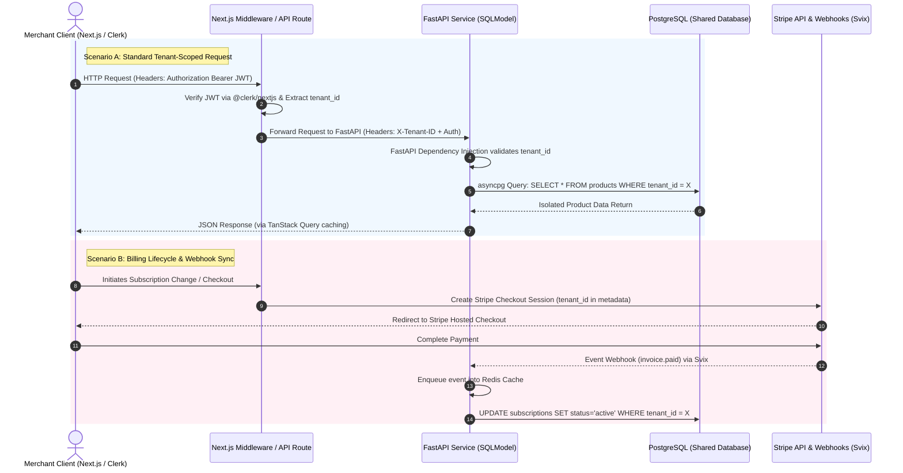

# Multi-Tenant Platform Architecture & Capabilities

## Overview

Next-Turborepo is a production-grade Turborepo template for Next.js apps. It's designed to be a comprehensive starting point for building SaaS applications, providing a solid, opinionated foundation with minimal configuration required.

Built on a decade of experience building web applications, Next-Turborepo balances speed and quality to help you ship thoroughly-built products faster.

## Shopify Architecture & Platform Capabilities

Shopify operates as a fully managed **Software as a Service (SaaS)** platform. It provides a foundational e-commerce ecosystem, eliminating the need for self-hosted infrastructure.

The platform architecture is divided into the following core components:

### 1. Storefront & Presentation Layer

* **Customisable Themes:** Built-in drag-and-drop tools and templates for web design.
* **Headless Commerce Capability:** Support for custom frontend frameworks via the Shopify-style Storefront API.

### 2. Infrastructure & Hosting

* **Cloud Hosting:** Fully managed server infrastructure that automatically scales with traffic spikes.
* **Security & Compliance:** Built-in Level 1 PCI-DSS compliance, SSL certificates, and automatic security patches.

### 3. Core Commerce Engine

#### 1. Checkout & Cart

* A highly optimized, secure checkout funnel capable of handling global transactions.

#### 2. Payment Processing

* Native integration via Shopify Payments alongside support for third-party gateways.

#### 3. Product & Catalog Management

* **Functionality:** The centralized database for all sellable items.
* **Key Features:** Support for physical, digital, and service-based products; complex variant management (size, color, material); product bundling; dynamic automated collections; and bulk editing capabilities.

#### 4. Inventory Management

* **Functionality:** Real-time tracking and allocation of stock.
* **Key Features:** Multi-location inventory tracking, automated low-stock alerts, inventory syncing across all sales channels to prevent overselling, and integration with purchase orders/suppliers.

#### 5. Order Management System (OMS)

* **Functionality:** The centralized hub for processing and tracking customer orders post-checkout.
* **Key Features:** Automated order routing (based on location or inventory), order editing, draft order creation, returns and refunds processing, and fulfillment workflow automation.

#### 6. Shipping & Fulfillment

* **Functionality:** The logistics layer that connects orders to physical delivery.
* **Key Features:** Native integrations with major global carriers (UPS, FedEx, DHL, etc.), real-time calculated shipping rates at checkout, automated label generation, tracking updates, and connections to third-party fulfillment networks (e.g., 3PLs).

#### 7. Tax Calculation & Compliance

* **Functionality:** Automated financial compliance for global selling.
* **Key Features:** Real-time automated tax calculations based on global jurisdictions and nexus rules, cross-border duty and import tax estimation, and automated tax reporting/filing integrations.

#### 8. Pricing, Promotions & Discounts

* **Functionality:** The rules engine for dynamic pricing and marketing incentives.
* **Key Features:** Discount code generation, automatic discounts (e.g., "Buy X Get Y"), gift card issuance and redemption, and customer-specific or tiered pricing rules.

#### 9. Customer Management (CRM)

* **Functionality:** The database of buyer identities and their relationship with the store.
* **Key Features:** Unified customer profiles, lifetime value (LTV) tracking, purchase history, customer segmentation, and native customer account portals (for order tracking, saved addresses, and wishlists).

#### 10. Global Commerce & Localization (Markets)

* **Functionality:** The infrastructure that allows a single store to sell seamlessly across international borders.
* **Key Features:** Multi-currency pricing and checkout, localized domain/language support, regional catalog management, and localized payment method routing.

#### 11. Omnichannel & Sales Channels

* **Functionality:** The ability to push the core commerce data to any customer touchpoint.
* **Key Features:** Native Point of Sale (POS) synchronization, social commerce integrations (Instagram, TikTok, Facebook), marketplace integrations (Amazon, Walmart), and embedded "Buy Button" APIs for external websites.

#### 12. B2B & Wholesale Engine

* **Functionality:** Specialized logic for business-to-business transactions (increasingly a core requirement for modern platforms).
* **Key Features:** Company profile management, net payment terms (e.g., Net 30/60), custom B2B price lists, quantity breaks, and self-serve buyer portals.

#### 13. Extensibility & APIs (The Connective Tissue)

* **Functionality:** The framework that allows the core engine to be modified or extended.
* **Key Features:** REST and GraphQL Admin APIs, Webhooks for real-time event broadcasting, and a structured app ecosystem for third-party developers to inject custom logic into the cart, checkout, or backend workflows.

### 4. Back-Office Logistics & Multi-Tenant Management

#### Architectural Tech Stack

* **Web Client & Admin Dashboard:** Built on **Next.js 16.2** (Node.js runtime) featuring **Shadcn Base UI** and **Tailwind CSS v4** for the presentation layer.
* **Frontend State & Validation:** Manages complex forms and server state using **React Hook Form** (`@hookform/resolvers`), **Zod** for schema validation, and **@tanstack/react-query** for atomic caching.
* **Data Layer & Storage:** Utilises **Drizzle-ORM** for primary relational queries alongside the **Supabase JS Client** for object storage and real-time utility hooks.
* **Backend Services:** High-throughput async engine powered by **FastAPI >=0.115.0** running on **Uvicorn**, using **SQLModel** for unified Pydantic data schemas and SQLAlchemy database orchestration.

#### Data Isolation Architecture

* **Shared-Schema Multi-Tenancy:** Single PostgreSQL instance running asynchronous connections via `asyncpg` and `psycopg3`. All core relational tables enforce strict logical isolation via a mandatory `tenant_id` foreign key column.
* **Data Migration Pipeline:** Schema updates and tracking are explicitly decoupled using **Alembic** for backend services and **Drizzle Kit** for frontend data layers.

#### Tenant Lifecycle & CRUD Operations

* **Tenant Provisioning (CRUD):** Admin controls to Create, Read, Update, and Delete isolated workspace entries, dynamically configuring specific tenant profiles.
* **Inventory & Order Management:** Shared-database, tenant-scoped workflows tracking isolated product catalogues, active variants, order states, and localized shipping setups.

#### Tenant Identity & Onboarding Workflow

* **Clerk Authentication Integration:** Cross-platform identity lifecycle managed natively using `@clerk/nextjs` on the client and the `clerk-backend-api` package within FastAPI services.
* **Automated Initialisation:** Self-service registration that binds a validated user identity to a newly generated `tenant_id`, initializing regional configurations like localized currencies and base tax profiles.

#### Billing Automation & Real-Time Hooks

* **Stripe Infrastructure:** Uses the **Stripe** SDK to automate tiered subscriptions, tier checking, metered developer endpoints, and invoice management.
* **Asynchronous Webhooks:** Handled via **Svix** and backed by **Redis** queues to digest critical real-time payment, signup, and tier events asynchronously without impacting core thread pools.

### 5. Extensibility & Ecosystem

* **App Marketplace:** A massive ecosystem of plug-and-play applications for marketing, SEO, and accounting.
* **Developer APIs:** Robust Admin GraphQL and REST APIs to build custom integrations and apps.

## Philosophy

**Next-Turborepo is built around five core principles:**

* Fast — Quick to build, run, deploy, and iterate on
* Cheap — Free to start with services that scale with you
* Opinionated — Integrated tooling designed to work together
* Modern — Latest stable features with healthy community support
* Safe — End-to-end type safety and robust security posture
* Doppler — promotes a DevSecOps philosophy —SecretOps— which advocates no hardcoded secrets in source files or scattered across .env files.

## Demo

**Experience Next-Turborepo in action:**

Web — Marketing website (apps/admin and apps/frontend)
App — Main application
API — API health check
Backend-API — Python FastAPI backend

## Features - Next-Turborepo comes with batteries included:**

**Apps**

* Web — Marketing site built with Tailwind CSS and TWBlocks
* App — Main application with authentication and database integration
* API — RESTful API with health checks and monitoring
* Docs — Documentation site powered by [....].
* Email — Email templates with React Email
* Storybook — Component development environment
* FastAPI generates a "schema" with all your API using the OpenAPI standard for defining APIs.

**Packages**

* Authentication — Powered by Clerk
* Database — Type-safe ORM with migrations
* Design System — Comprehensive component library with dark mode
* Payments — Subscription management via Stripe
* Email — Transactional emails via Resend
* Analytics — Web (Google Analytics) and product (Posthog)
* Observability — Error tracking (Sentry), logging, and uptime monitoring (BetterStack)
* Security — Application security (Arcjet), rate limiting, and secure headers
* CMS — Type-safe content management for blogs and documentation
* SEO — Metadata management, sitemaps, and JSON-LD
* AI — AI integration utilities
* Webhooks — Inbound and outbound webhook handling
* Collaboration — Real-time features with avatars and live cursors
* Feature Flags — Feature flag management
* Cron — Scheduled job management
* Storage — File upload and management
* Internationalization — Multi-language support
* Notifications — In-app notification system

* Stack includes FastAPI, SQLModel, and Row Level Security (RLS).

_______________

_________________;

